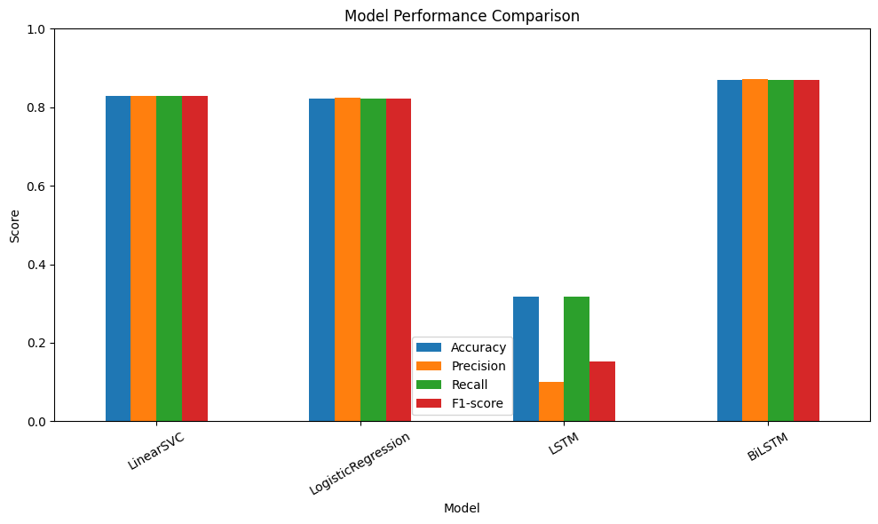
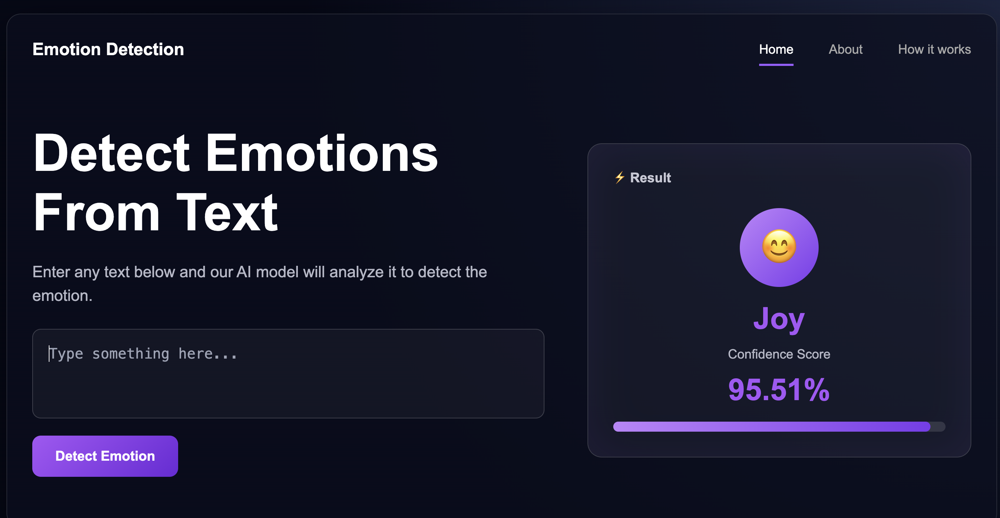

# Emotion Detection from Text
## Overview
An Emotion Detection from Text system was developed using both Machine Learning and Deep Learning techniques. This project aims to find the best algorithm to classify English text to four emotion categories : anger, fear, joy and sadness. The comparative study was conducted with four classification models which are Logistic Regression, Linear Support Vector Classifier (LinearSVC), Long Short-Term Memory (LSTM) and Bidirectional Long Short-Term Memory (BiLSTM). The project shows a complete Natural Language Processing (NLP) pipeline including Exploratory Data Analysis (EDA), text preprocessing, tokenizing, word embedding, model training, performance evaluation and deployment with a Flask web application. 
## Dataset
The models were trained and tested on the ISEAR (International Survey on Emotion Antecedents and Reactions) Emotion Dataset from Kaggle. The dataset contains 7102 English text samples  with four emotional categories: anger, fear, joy and sadness.
## Result
## 📊 Model Performance Comparison

To evaluate the effectiveness of different approaches for emotion classification, four models were implemented and compared using **Accuracy**, **Precision**, **Recall**, and **F1-score**.

### Performance Comparison

| Model | Accuracy | Precision | Recall | F1-score |
|:------|---------:|----------:|--------:|---------:|
| **LinearSVC** | **82.92%** | **82.99%** | **82.92%** | **82.91%** |
| **Logistic Regression** | **82.12%** | **82.38%** | **82.12%** | **82.09%** |
| **LSTM** | **31.74%** | **10.07%** | **31.74%** | **15.29%** |
| **BiLSTM** | **87.05%** | **87.07%** | **87.05%** | **87.04%** |

### Performance Visualization

<p align="center">
  
</p>

## Installation

Follow the steps below to run this project locally.

### 1. Clone the repository

```bash
git clone https://github.com/MoeNi11/emotion-detection.git
```

### 2. Navigate to the project directory

```bash
cd emotion_detection
```

### 3. Install the required dependencies

```bash
pip install -r requirements.txt
```

### 4. Run the Flask application

**run server.py**:

```bash
python server.py
```

### 5. Open the application in your browser

```
http://127.0.0.1:5000
```

## Demo

<p align="center">
    
</p>
